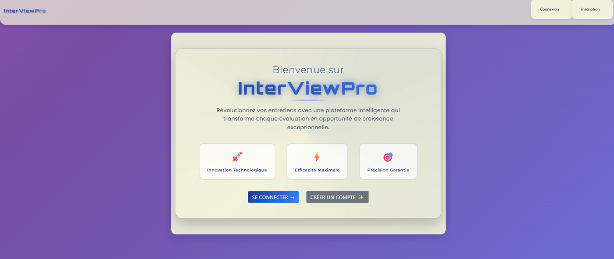
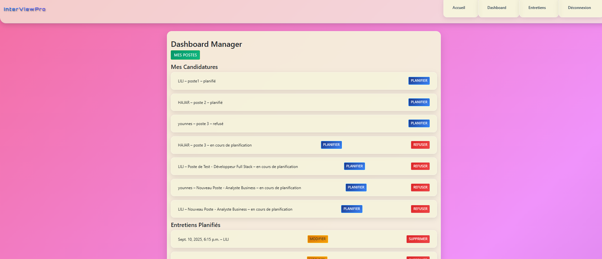
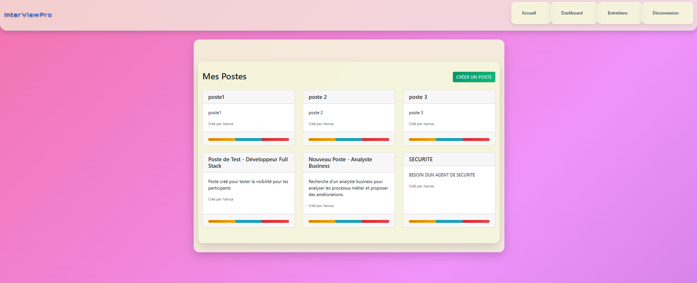
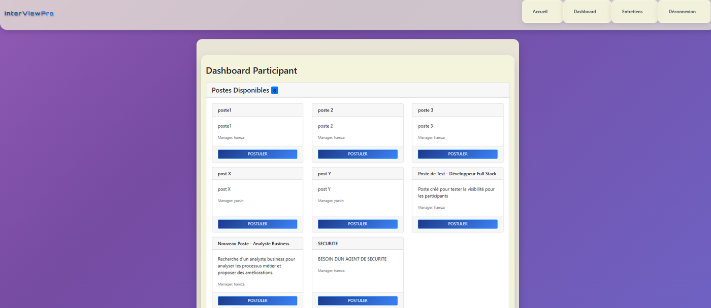

# InterViewPro : application de gestion des entretiens de recrutement

Application web développée pendant mon stage chez INOVA Services (juillet 2025). Elle permet à une entreprise de publier des postes, de recevoir des candidatures et de planifier les entretiens, avec un espace dédié à chaque type d'utilisateur.

## Fonctionnalités

L'application gère trois rôles, chacun avec son propre tableau de bord.

Administrateur. Il a une vue d'ensemble des utilisateurs, des postes et des entretiens. Les comptes managers restent inactifs à l'inscription jusqu'à leur activation depuis l'interface d'administration Django.

Manager. Il crée, modifie et supprime des offres de poste, consulte les candidats de chaque poste, refuse une candidature ou planifie un entretien. Lors de la planification, le candidat reçoit automatiquement un e-mail de convocation. Le manager peut ensuite rédiger le compte rendu de l'entretien.

Participant (candidat). Il consulte les postes ouverts, postule en un clic et suit l'état de ses candidatures : en cours de planification, planifié ou refusé.

## Aperçu

Page d'accueil

Tableau de bord du manager : candidatures reçues et entretiens planifiés

Gestion des postes par le manager

Tableau de bord du candidat : postes disponibles et suivi des candidatures

## Technologies

Python, Django 5, SQLite, HTML et CSS (templates Django), envoi d'e-mails par SMTP, python-decouple pour la configuration.

## Organisation du code

`projet_django/` contient la configuration du projet (paramètres, URL principales).
`my_app/models.py` définit les données : utilisateurs et rôles, postes, candidatures et entretiens.
`my_app/views.py` contient la logique de chaque page (connexion, tableaux de bord, postes, candidatures, entretiens).
`my_app/templates/` contient les pages HTML.
`my_app/signals.py` crée automatiquement la fiche détaillée d'un manager à son inscription.

## Auteure

Loubna Rhoufal, élève ingénieure en Intelligence Artificielle et Data Science à l'EMSI.
[LinkedIn](https://www.linkedin.com/in/loubna-rhoufal-419204354/)
